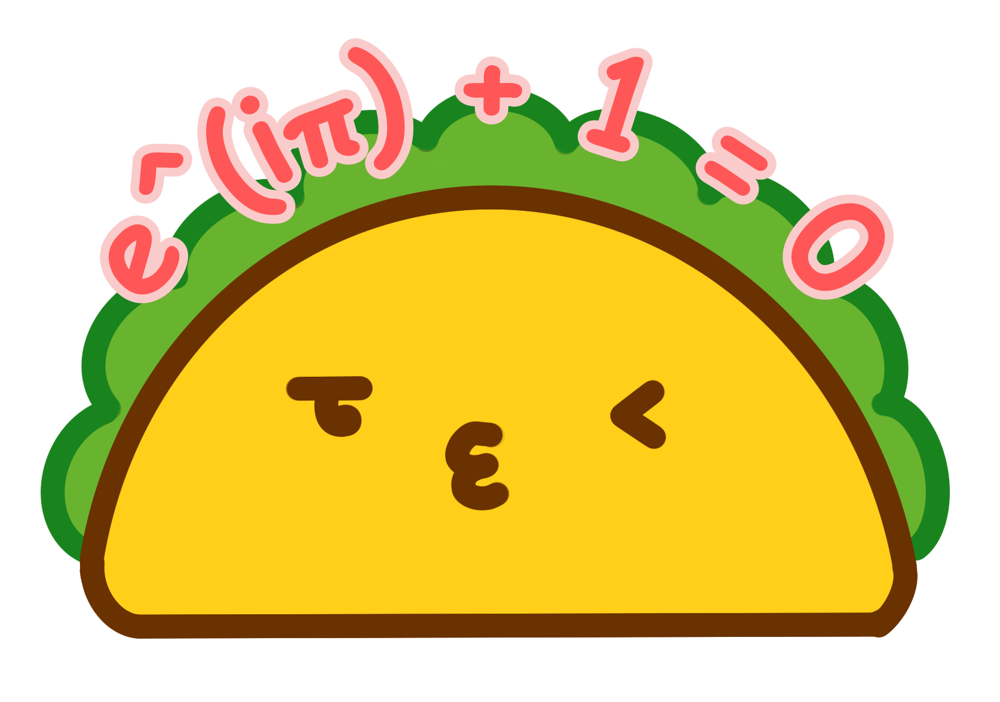

<p align="center" style="margin-bottom: 0">
  
</p>
<div align="center" style="font-size: 2.5em; font-weight: bold;margin-top: 0; margin-bottom: 0;">Texo</div>
<p align="center" style="margin-top: 0"><em>/ˈtɛːkoʊ/</em></p>

<p align="center">
  A minimalist LaTeX OCR model which contains only 20M parameters.
</p>

## Features
- Fast and lightweight inference.
- Trainable on consumer's-level GPU.
- Well organized code as a tutorial.
- Running in browser!

## Performance

Texo is a distilled version of PPFormulaNet-S and finetuned on UniMERNet-1M, hence it should preserve the most part of the performance compared to PPFormulaNet-S.

|           Model            |      Params      | Metric        | SPE    | CPE    | SCE    | HWE    |
| :------------------------: | :--------------: | ------------- | ------ | ------ | ------ | ------ |
|  UniMERNet-T<sup>&dagger;</sup>   |       107M       | BLEU          | 0.909  | 0.902  | 0.566  | 0.883  |
|                            |                  | Edit distance | 0.066  | 0.075  | 0.239  | 0.078  |
| PPFormulaNet-S<sup>&dagger;</sup> |       57M        | BLEU          | 0.8694 | 0.8071 | -      | -      |
|                            |                  | Edit distance | -      | -      | -      | -      |
|  Texo-distill<sup>*</sup>  |       20M        | BLEU          | 0.9014 | 0.8909 | 0.7034 | 0.8606 |
|                            |                  | Edit distance | 0.0780 | 0.1042 | 0.1941 | 0.0995 |
| Texo-transfer<sup>*</sup>  | 20M<sup>**</sup> | BLEU          | 0.8597 | 0.8334 | 0.5549 | 0.7973 |
|                            |                  | Edit distance | 0.0980 | 0.1306 | 0.2187 | 0.0999 |

We only list the lightweight version for the SOTA models, as we can see in terms of sequential metrics like BLEU or Edit distance, our model has comparable performance while reducing a lot of parameters.

> `-` means not reported in the paper.
> 
> &dagger;: Copy from the paper
> 
> *: Texo-distill uses the same tokenizer as UniMERNet and PPFormulaNet, hence the sequential metrics are strictly comparable. While Texo-transfer uses a customized tokenizer hence the metrics are not comparable (we have a shorter sequence length, see more in [notes](./TechnoSelection/notes.md)). Of course a more fair evaluation metric for LaTeX-OCR should be the [CDM](http://arxiv.org/abs/2409.03643), but I'm lazy to do it due to its implementation complexity.
> 
> **: Slightly less than Texo-distill as the tokenizer's vocab is smaller.

## Configure environment
```sh
git clone https://github.com/alephpi/Texo
uv sync
```
> For those who don't use uv, it worths to try it. For those who insist not to use, I guess you know how to adapt.

## Download Dataset (UniMER-1M)
Following https://huggingface.co/datasets/wanderkid/UniMER_Dataset as what I've done

If you are lazy, use the one that I arranged and normalized.
- https://huggingface.co/datasets/alephpi/UniMER-Train
- https://huggingface.co/datasets/alephpi/UniMER-Test

## Tokenizer
If you are interested in all the preprocessings, check [here](./data/tokenizer) and [here](./scripts/python/normalize.py), where I collected and sorted all the useful KaTeX commands.

## Training
We use `hydra` to manage training configurations and experiments.

```sh
# train
python src/train.py
```
```sh
# resume from a checkpoint
python src/train.py training.resume_from_ckpt="<ckpt_path>"
```
```sh
# debug
python src/train.py --config-dir="./config" --config-name="train_debug.yaml"
```
```sh
# train on a slurm cluster
python src/train.py --multirun --config-dir="./config" --config-name="train_slurm.yaml"
```
See other training configurations in [config](./config/) directory.

### Check training log
The training results would be stored in [outputs](./outputs) directiory, to visualize the training logs, run

```sh
tensorboard --logdir outputs
```

### Figures
Some beautiful loss curves to give you an impression of the loss scale and convergence process.

#### Training loss


#### Validation loss


#### BLEU


#### Edit distance


#### Learning rate


## Acknowledgements

- [transformers](https://github.com/huggingface/transformers): framework, model decoder, tokenizer
- [UniMERNet](https://github.com/opendatalab/UniMERNet): dataset, image processor
- [Im2Markup](https://github.com/harvardnlp/im2markup): latex preprocessing
- [KaTeX](https://github.com/KaTeX/KaTeX): latex vocabulary for training tokenizer and latex parser for preprocessing
- [my-unimernet](https://github.com/ParaN3xus/my-unimernet/blob/main/unimernet/components/processor/image_processor.py): image processor (plus a nice codebase to demystify UniMERNet)
- [PaddleOCR](https://github.com/PaddlePaddle/PaddleOCR/blob/main/ppocr/modeling/backbones/rec_pphgnetv2.py): model architecture, pretraining weights
- [PaddleOCR2Pytorch](https://github.com/frotms/PaddleOCR2Pytorch) and [D-FINE](https://github.com/Peterande/D-FINE): model encoder implementation
- [Im2Markup](https://github.com/harvardnlp/im2markup), [LaTeX-OCR](https://github.com/lukas-blecher/LaTeX-OCR) and [TrOCR](https://github.com/microsoft/unilm/tree/master/trocr): pioneers
- [MixTeX](https://github.com/RQLuo/MixTeX-Latex-OCR) and [TexTeller](https://github.com/OleehyO/TexTeller): motivation
- My cousin 润吉 for helping me draw the logo. BTW, it is a taco in case you guys don't recognize it.
