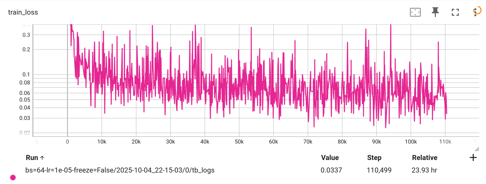
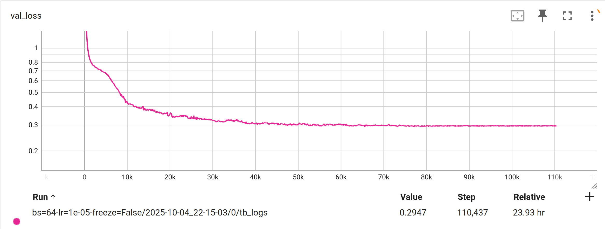
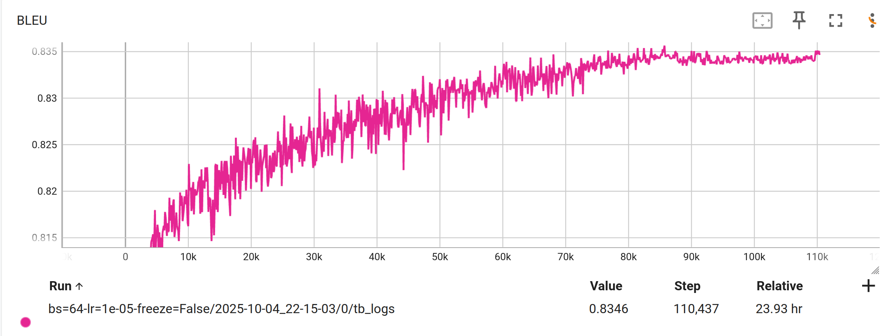
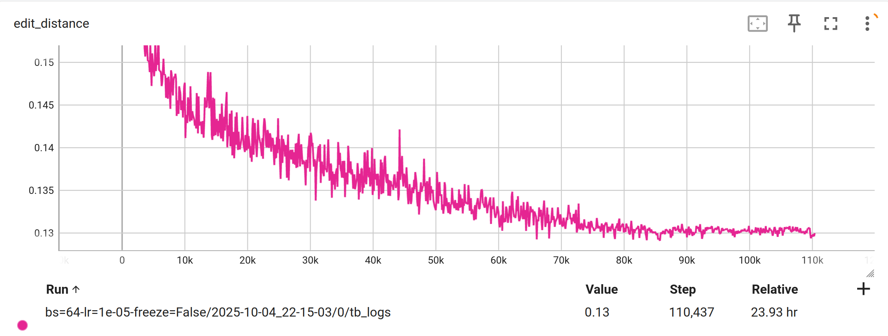
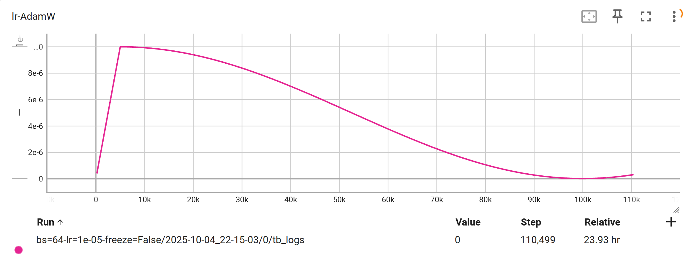

<p align="center" style="margin-bottom: 0">
  
  
</p>
<p align="center" style="font-size: 0.9em">
Texo is pronounced as /ˈtɛːkoʊ/
</p>
<p align="center">
  A minimalist free and open-source SOTA LaTeX OCR model which contains only 20M parameters.
</p>

<div align="center">
  
  [Try it online](https://texocr.netlify.app)
  
</div>
<div align="center">
  
  Technical report: [arXiv](https://arxiv.org/abs/2602.17189), [HAL](https://hal.science/hal-05510395)

</div>

## Features
- Free and open-source.
- Fast and lightweight inference.
- Trainable on consumer's-level GPU.
- Well organized code as a tutorial.
- [Running in browser!](https://github.com/alephpi/Texo-web)

>[!Note]
> Feel honored been collected in [@ruanyf's weekly](https://www.ruanyifeng.com/blog/2025/11/weekly-issue-372.html), if you are a user from there, and have an issue on visit the website, please leave a message in [Texo-web](https://github.com/alephpi/Texo-web) repo. Due to my limited front-end skills, please contribute to help me in any form.
> 
> 很荣幸被 [《阮一峰的科技周刊》](https://www.ruanyifeng.com/blog/2025/11/weekly-issue-372.html) 收录，如果你从那里过来，并且在访问 demo 网站时出现 bug，请移步至 [Texo-web](https://github.com/alephpi/Texo-web) 仓库报告。由于我前端水平有限，欢迎各位不吝赐教。

## Prelude
Despite a growing number of STEM and AI learners with their note-taking needs today, a free, fast, more accessible yet precise LaTeX OCR tool is still absent. Lying exactly in the comfort zone of machine learning due to the closed vocabulary and less generalization requirements, such classical pattern recognition task can be considered as solved thanks to recent deep learning progress(TrOCR, GOT-2.0, UniMERNet, PPFormulaNet). So here comes the Texo, which tackles this problem in the scope of a personal project.

It is also a comprehensive practice to combine the knowledge and experiences I learned so far from school and online, as well as a tentative contribution to my beloved open source community.

## Performance

Texo is a distilled version of PPFormulaNet-S and finetuned on UniMERNet-1M, hence it should preserve the most part of the performance compared to PPFormulaNet-S. Here is the evaluation results on the UniMERNet-Test dataset.

|               Model               |      Params      | Metric        | SPE    | CPE    | SCE    | HWE    |
| :-------------------------------: | :--------------: | ------------- | ------ | ------ | ------ | ------ |
|  UniMERNet-T<sup>&dagger;</sup>   |       107M       | BLEU          | 0.909  | 0.902  | 0.566  | 0.883  |
|                                   |                  | Edit distance | 0.066  | 0.075  | 0.239  | 0.078  |
| PPFormulaNet-S<sup>&dagger;</sup> |       57M        | BLEU          | 0.8694 | 0.8071 | -      | -      |
|                                   |                  | Edit distance | -      | -      | -      | -      |
|     Texo-distill<sup>*</sup>      |       20M        | BLEU          | 0.9014 | 0.8909 | 0.7034 | 0.8606 |
|                                   |                  | Edit distance | 0.0780 | 0.1042 | 0.1941 | 0.0995 |
|     Texo-transfer<sup>*</sup>     | 20M<sup>**</sup> | BLEU          | 0.8597 | 0.8334 | 0.5549 | 0.7973 |
|                                   |                  | Edit distance | 0.0980 | 0.1306 | 0.2187 | 0.0999 |
|     Texo-transfer-onnx            |     as above     | BLEU          | 0.8395 | 0.8136 | 0.5153 | 0.7787 |
|                                   |                  | Edit distance | 0.0980 | 0.1288 | 0.2050 | 0.0976 |

We only list the lightweight version for the SOTA models, as we can see in terms of sequential metrics like BLEU or Edit distance, our model has comparable performance while reducing a lot of parameters. 

> `-` means not reported in the paper.
> 
> &dagger;: Copy from the paper
> 
> *: Texo-distill uses the same tokenizer as UniMERNet and PPFormulaNet, hence the sequential metrics are strictly comparable. While Texo-transfer uses a customized tokenizer hence the metrics are not comparable (we have a shorter sequence length, see more in [notes](./TechnoSelection/notes.md)). Of course a more fair evaluation metric for LaTeX-OCR should be the [CDM](http://arxiv.org/abs/2409.03643), but I'm lazy to do it due to its implementation complexity.
> 
> **: Slightly less than Texo-distill as the tokenizer's vocab is smaller.

## Configure environment
```sh
git clone https://github.com/alephpi/Texo
uv sync
```
> For those who don't use uv, it worths to try it. For those who insist not to use, I guess you know how to adapt.

## Download model
```sh
# model only
python scripts/python/hf_hub.py pull
```
```sh
# for those who want to train from useful checkpoints
python scripts/python/hf_hub.py pull --with_useful_ckpts
```

## Inference
Check [`demo.ipynb`](./demo.ipynb)

## Training

### Requirements
- Mine: 50G CPU memory, A40/L40S 46G.
- Recommend: 50G CPU memory, 40G GPU memory.
- Minimal: 20G CPU memory(with streaming dataloading) and 16G GPU memory(with accumulative gradient).

### Download dataset (UniMER-1M)
Following https://huggingface.co/datasets/wanderkid/UniMER_Dataset as what I've done

If you are lazy, use the one that I arranged and normalized.
- https://huggingface.co/datasets/alephpi/UniMER-Train
- https://huggingface.co/datasets/alephpi/UniMER-Test

If you are interested in all the preprocessings, check [here](./data/tokenizer) and [here](./scripts/python/normalize.py), where I collected and sorted all the useful KaTeX commands.

### Launch
We use `hydra` to manage training configurations and experiments.

```sh
# train
python src/train.py
```
```sh
# resume from a checkpoint
python src/train.py training.resume_from_ckpt="<ckpt_path>"
```
```sh
# debug
python src/train.py --config-dir="./config" --config-name="train_debug.yaml"
```
```sh
# train on a slurm cluster
python src/train.py --multirun --config-dir="./config" --config-name="train_slurm.yaml"
```
See other training configurations in [config](./config/) directory.

### Log
The training results are stored in [outputs](./outputs) directiory. To visualize it, run

```sh
tensorboard --logdir outputs
```

### Figures
Some beautiful loss curves to give you an impression of the loss scale and the convergence process.

#### Training loss


#### Validation loss


#### BLEU


#### Edit distance


#### Learning rate


## Reproduce the whole work

If you want to start from scratch, check my [notes](./TechnoSelection/notes.md)

## Acknowledgements

- [transformers](https://github.com/huggingface/transformers): framework, model decoder, tokenizer
- [UniMERNet](https://github.com/opendatalab/UniMERNet): dataset, image processor
- [Im2Markup](https://github.com/harvardnlp/im2markup): latex preprocessing
- [KaTeX](https://github.com/KaTeX/KaTeX): latex vocabulary for training tokenizer and latex parser for preprocessing
- [my-unimernet](https://github.com/ParaN3xus/my-unimernet/blob/main/unimernet/components/processor/image_processor.py): image processor (plus a nice codebase to demystify UniMERNet)
- [PaddleOCR](https://github.com/PaddlePaddle/PaddleOCR/blob/main/ppocr/modeling/backbones/rec_pphgnetv2.py): model architecture, pretraining weights
- [PaddleOCR2Pytorch](https://github.com/frotms/PaddleOCR2Pytorch) and [D-FINE](https://github.com/Peterande/D-FINE): model encoder implementation
- [Im2Markup](https://github.com/harvardnlp/im2markup), [LaTeX-OCR](https://github.com/lukas-blecher/LaTeX-OCR) and [TrOCR](https://github.com/microsoft/unilm/tree/master/trocr): pioneers
- [MixTeX](https://github.com/RQLuo/MixTeX-Latex-OCR) and [TexTeller](https://github.com/OleehyO/TexTeller): motivation
- Telecom Paris for providing the GPU cluster.

## License
[AGPL-3.0](https://www.gnu.org/licenses/agpl-3.0.html)

Copyright (C) 2025-present Sicheng Mao <maosicheng98@gmail.com>

## Star History

[](https://www.star-history.com/#alephpi/Texo&type=date&legend=top-left)
